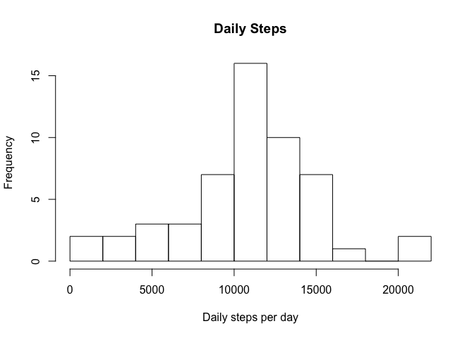
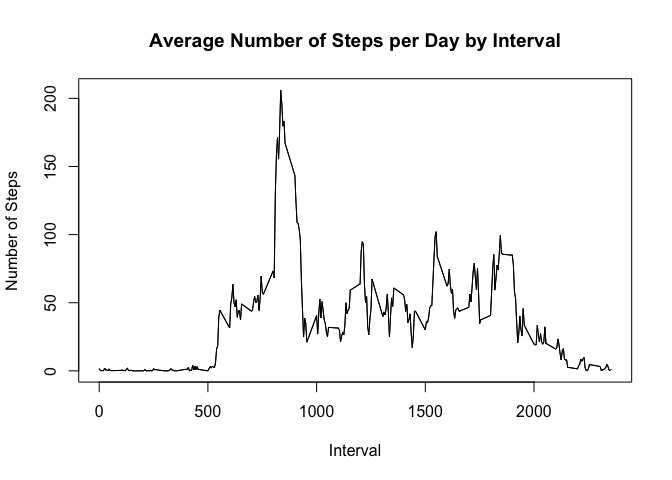
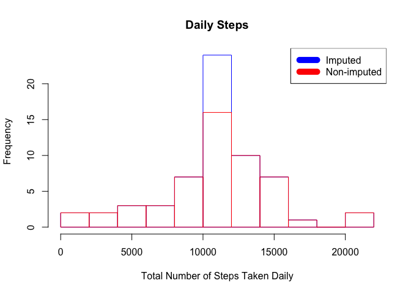
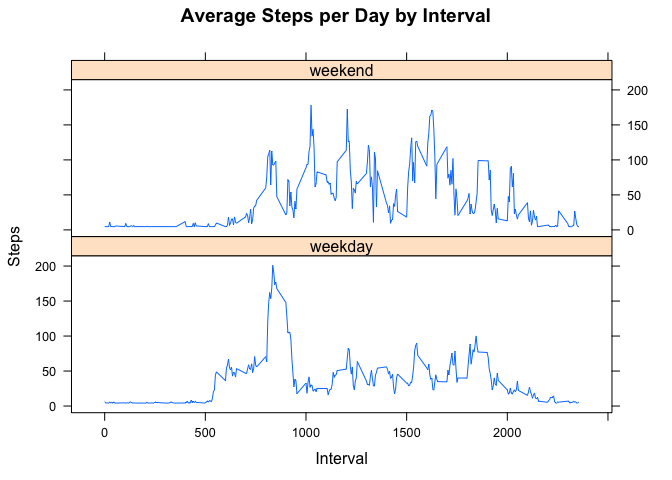

R Markdown
----------

Loading and preprocessing the data
----------------------------------

The following code loads the file from a url and unzips into a variable called activity. Then the date column is converted to the date datatype, and the data set is converted to a data frame.

``` r
# create a temporary directory
td <- tempdir() 
# create a temporary file
tf <- tempfile(tmpdir=td, fileext=".zip") 
# download zip file from URL
download.file("https://d396qusza40orc.cloudfront.net/repdata%2Fdata%2Factivity.zip", tf, mode="wb", method = "curl")
# unzip file and save as activity variable
fname <- unzip(tf, list=TRUE)$Name[1] 
unzip(tf, files=fname, exdir=td, overwrite=TRUE) 
fpath <- file.path(td, fname)
activity <- read.csv(fpath)


activity$date <- as.Date(activity$date, "%Y-%m-%d")
activity <- as.data.frame(activity)
```

What is mean total number of steps taken per day?
-------------------------------------------------

1.  Calculate the total number of steps taken per day

``` r
steps.day <- aggregate(steps ~ date, activity, sum)
colnames(steps.day) <- c("date", "steps")
head(steps.day)
```

    ##         date steps
    ## 1 2012-10-02   126
    ## 2 2012-10-03 11352
    ## 3 2012-10-04 12116
    ## 4 2012-10-05 13294
    ## 5 2012-10-06 15420
    ## 6 2012-10-07 11015

1.  Make a histogram of the total number of steps taken each day

``` r
hist(steps.day$steps,
     main = "Daily Steps",
     breaks = 10,
     xlab = "Daily steps per day")
```



1.  Calculate and report the mean and median of the total number of steps taken per day

``` r
steps <- with(activity, tapply(steps, date, sum, na.rm = TRUE))

steps.mean <- round(mean(steps), digits = 0)
steps.median <- median(steps)
```

### The mean and the median of the total steps per day are 9354 and 10395.

What is the average daily activity pattern?
-------------------------------------------

``` r
steps.interval <- aggregate(x = list(steps = activity$steps), by = list(interval = activity$interval), FUN = mean, na.rm = TRUE)

colnames(steps.interval) <- c("interval", "steps")
```

1.  Make a time series plot (i.e. 𝚝𝚢𝚙𝚎 = "𝚕") of the 5-minute interval (x-axis) and the average number of steps taken, averaged across all days (y-axis)

``` r
plot(as.numeric(as.character(steps.interval$interval)),steps.interval$steps, type="l", xlab="Interval", ylab="Number of Steps",main="Average Number of Steps per Day by Interval")
lines(as.numeric(as.character(steps.interval$interval)),steps.interval$steps, type="l")
```



1.  Which 5-minute interval, on average across all the days in the dataset, contains the maximum number of steps?

``` r
max.interval <- steps.interval$interval[steps.interval$steps == max(steps.interval$steps)]
```

### The 5-minute interval that contains on average the maximum number of step is interval number 835.

Imputing missing values
-----------------------

1.  Calculate and report the total number of missing values in the dataset (i.e. the total number of rows with NAs)

``` r
missing_vals <- sum(is.na(activity$steps))
```

The number of missing values is 2304. 2. Devise a strategy for filling in all of the missing values in the dataset. The strategy does not need to be sophisticated. For example, you could use the mean/median for that day, or the mean for that 5-minute interval, etc.

``` r
newdata <- activity
which.na <- is.na(newdata$steps)
newdata$steps[which.na] <- steps.interval$steps[steps.interval$interval == newdata$interval[which.na]]
newdata$steps[is.na(newdata$steps)] <- mean(activity$steps, na.rm=TRUE)
```

1.  Create a new dataset that is equal to the original dataset but with the missing data filled in.

``` r
sum(is.na(newdata$steps))
```

    ## [1] 0

1.  Make a histogram of the total number of steps taken each day and Calculate and report the mean and median total number of steps taken per day. Do these values differ from the estimates from the first part of the assignment? What is the impact of imputing missing data on the estimates of the total daily number of steps?

``` r
new.day.steps <- aggregate(steps ~ date, newdata, sum)
colnames(new.day.steps) <- c("date","steps")
```

``` r
hist(new.day.steps$steps, 
     main="Daily Steps",
     breaks=10,
     xlab="Total Number of Steps Taken Daily", border="blue")
hist(steps.day$steps, breaks=10, border="red", xlab="Number of Steps", add=T)
legend("topright", c("Imputed", "Non-imputed"), col=c("blue", "red"), lwd=10)
```



``` r
steps.mean.new   <- mean(new.day.steps$steps, na.rm=TRUE)
steps.median.new <- median(new.day.steps$steps, na.rm=TRUE)
```

The new mean and the median of the total number of steps taken per day are 1.076618910^{4} and 1.076618910^{4}. The outliers are gone so the mean and the median are closer.

Are there differences in activity patterns between weekdays and weekends?
-------------------------------------------------------------------------

1.  Create a new factor variable in the dataset with two levels – “weekday” and “weekend” indicating whether a given date is a weekday or weekend day.

``` r
newdata$weekdayType <- ifelse(weekdays(newdata$date) %in% c("Satuday", "Sunday"), 
    "weekend", "weekday")

head(newdata)
```

    ##       steps       date interval weekdayType
    ## 1 1.7169811 2012-10-01        0     weekday
    ## 2 0.3396226 2012-10-01        5     weekday
    ## 3 0.1320755 2012-10-01       10     weekday
    ## 4 0.1509434 2012-10-01       15     weekday
    ## 5 0.0754717 2012-10-01       20     weekday
    ## 6 2.0943396 2012-10-01       25     weekday

1.  Make a panel plot containing a time series plot (i.e. type = "l") of the 5-minute interval (x-axis) and the average number of steps taken, averaged across all weekday days or weekend days (y-axis).

``` r
steps.interval.i <- aggregate(steps ~ interval + weekdayType, newdata, mean)

library(lattice)

xyplot(steps.interval.i$steps ~ as.numeric(as.character(steps.interval.i$interval))|steps.interval.i$weekdayType, main="Average Steps per Day by Interval",xlab="Interval", ylab="Steps",layout=c(1,2), type="l")
```



### It appears that this is more activity during the weekend.
